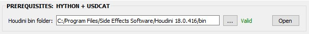
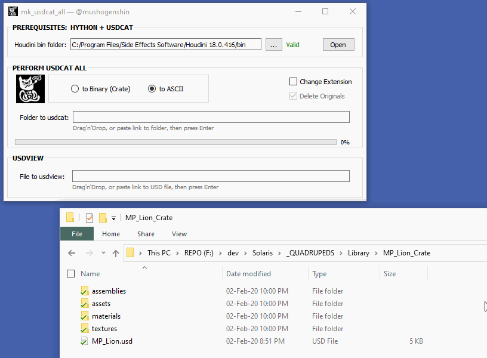
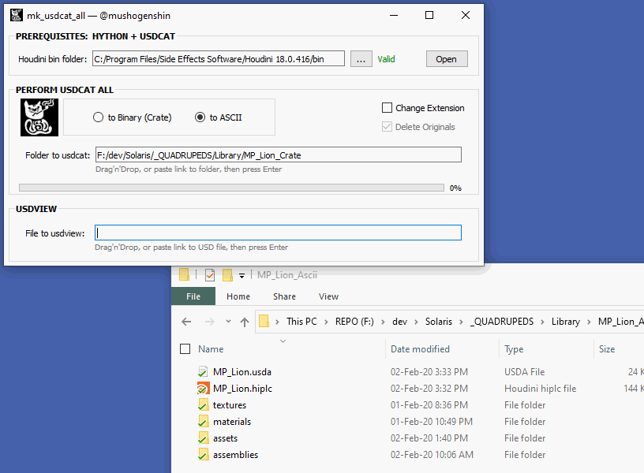
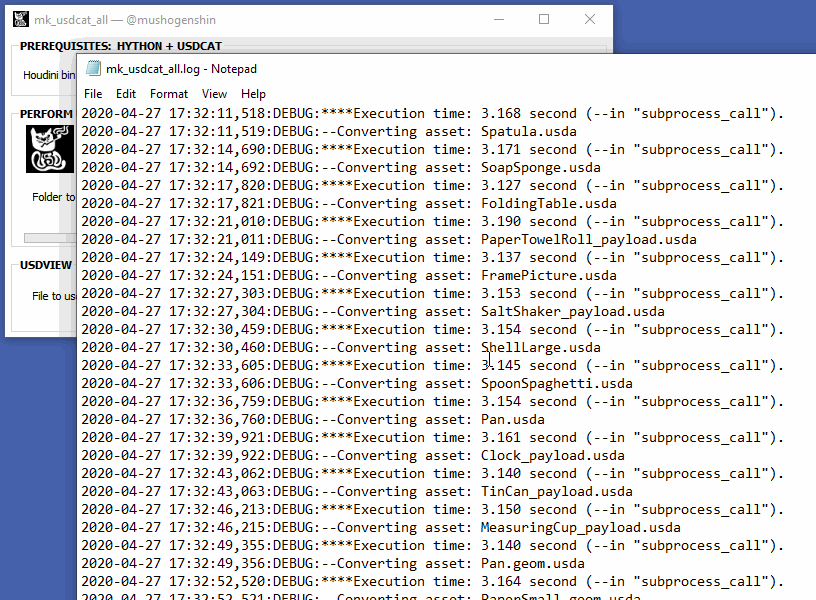
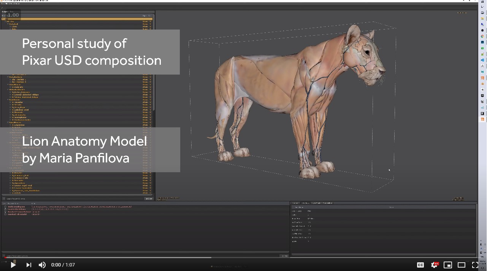

[//]: # (Author: mushogenshin@gmail.com)

# mk_usdcat_all

# WHAT

This is a small, stand-alone, utility tool written in Python for Windows that allows you to batch convert between [Pixar USD] binary and ASCII formats. Under the hood it employs Houdini [hython] and the native USD support in [Houdini Solaris], so Houdini 18 is required, and also at least an Indie license — in order to write out *.usda* file format.

A compiled *.exe* is also provided for ease of use.

# WHY

Pixar USD is super exciting and powerful. And Houdini Solaris is, too! While learning USD, there are several very good, official, examples — the [Kitchen set] and [Shopfront][LOPs tutorials] — either by Pixar or by SideFX, but unfortunately they are all provided in USD binary — thus obviously not human-readable — format (named the [crate format]). So in the process of learning, I found myself wanting to be able to decipher more how each part in those USD files contributes to the final [scene composition]. Of course one can always take advantage of the displayed USD scene graph either in [usdview] or in Solaris, or take advantage of the LOPs code in Solaris, but I believe the ability to read the *.usda* (as text file) would be extremely helpful and eye-opening. 

Luckily Pixar already provides "[usdcat]" — an utility in their [USD toolset] — which allows for convenient conversion among *.usda*, *.usdb*, and *.usdc* formats. Just some small catches:

1. We would want to convert multiple files. The [kitchen example][Kitchen set] has 230 USD files. It's great that [usdcat] accepts multi-file input, but the idea of manually passing hundreds of file paths as command arguments sounds not so fun.
2. Though very likely an outlier case and a rather subpar practice, in case you also want to change the file extensions during conversion, e.g. from *.usdc* to *.usda* and vice versa, then you would then also need to tweak the references in the USD file content in order to have the USD [asset resolution] working. For example, after our binary to ASCII conversion, all lines that have `"@/any_asset.usd@"` in the resulted files must also be changed to `"@/any_asset.usda@"`

This poses a great opportunity for a simple batch conversion tool, hence our **mk_usdcat_all**!

# HOW
The tool is very simple to use.

First take a look at the Prerequisites line edit in the UI and make sure the tool know where to look for **hython** and **usdcat**, both in the "**bin**" folder within your Houdini installation folder.

Most of the time you would want to perform **usdcat** in bulk. So drop the folder containing all the USD files to the second line edit (see below) to batch convert *all* USD files found within that folder. You can also copy and paste the link to that folder there. Then from that line edit press Enter to start the batch conversion process.

**Hython** will then summon **usdcat** to perform conversion between USD formats, file by file. This might take a while, firstly of course depending on how many USD files there are in the specified folder, and also how heavy they are, but secondly due to the fact that **hython** also needs to verify your Houdini license each time.

After it's done (you can tell by looking at the progress bar in the UI), you can use the wonderful [usdview] that is also shipped with Houdini Solaris to view and verify the results.

There will be a generated log file that details how much time it takes for each conversion job.

# SOME BENCHMARKS

* The Pixar [Kitchen set] with 230 USD files took about 730 seconds (~12 mins) to convert everything from crate format to ASCII. The project size increased to 32 MB from 5 MB. 

* I carried a test with a small project of mine using the [Lion anatomy model by Maria Panfilova][lion anatomy model], in which I used Houdini PDG to generate >400 USD binary files — including all the *payload*, material, and assembly, files —. The project size before conversion was about 16 MB. The conversion took 1380 seconds (~23 mins), and the project size increased to 97 MB. After batch converting all 444 USD files using our **usdcat** tool, the whole project still works nicely without any issues.

# KNOWN ISSUES

Using the *.exe* may spare you from all the Python environment setup, but **hython** command prompts will keep popping up throughout the batch conversion process, which rather makes it inconvenient to use your machine during that time.

# FEEDBACK & SUGGESTIONS

If you have any feedback or suggestions, feel free to send me a message. Thanks!

# CREDITS

The "USD cat" mascot icon and banner were designed by my girlfriend [Rkaixg].

[hython]: https://www.sidefx.com/docs/houdini/hom/commandline.html#hython
[Pixar USD]: https://graphics.pixar.com/usd/docs/index.html
[Houdini Solaris]: https://www.sidefx.com/products/houdini/solaris/
[crate format]: http://graphics.pixar.com/usd/docs/USD-Glossary.html#USDGlossary-CrateFileFormat
[scene composition]: http://graphics.pixar.com/usd/files/Siggraph2019_USD%20Composition.pdf
[usdview]: https://graphics.pixar.com/usd/docs/USD-Toolset.html#USDToolset-usdview
[usdcat]: https://graphics.pixar.com/usd/docs/USD-Toolset.html#USDToolset-usdcat
[USD Toolset]: https://graphics.pixar.com/usd/docs/USD-Toolset.html
[Kitchen set]: http://graphics.pixar.com/usd/downloads.html
[LOPs tutorials]: https://www.sidefx.com/docs/houdini/solaris/tutorials.html
[asset resolution]: http://graphics.pixar.com/usd/docs/USD-Glossary.html#USDGlossary-AssetResolution
[Rkaixg]: https://rkaixg.tumblr.com/
[lion anatomy model]: https://www.artstation.com/artwork/vGG46
